# KafkaSend Protocol Specification

This document describes the message protocol used by KafkaSend to transmit files and HTTP requests through Kafka topics.

## Overview

KafkaSend uses a chunked message protocol to enable large file transfers (up to 50MB+) through Kafka, which has message size limitations. The protocol supports:

- Multi-chunk file transfers with sequence ordering
- Job-based request/response correlation
- Multiple HTTP methods (GET, POST, PUT, PATCH, DELETE)
- Custom headers and multipart file uploads
- CRC32 checksum validation for data integrity
- Error handling and status reporting

## Architecture

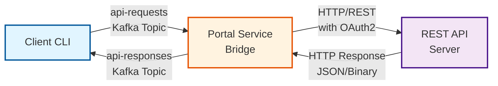

## Message Types

The protocol defines three message types:

| Type | Purpose |
|------|---------|
| `START` | Initiates a new job with metadata and configuration (never contains data) |
| `CHUNK` | Carries a chunk of data (base64 encoded for binary, plain text for text-based content) |
| `ERROR` | Reports errors during processing |

## Bidirectional Chunking

The KafkaSend protocol implements **bidirectional chunking** to handle large data in both directions:

### Request Direction: Client → Portal

**Client responsibilities:**
- Calculate chunk count based on file size
- Split large files into 650KB chunks
- Base64 encode each chunk
- Send START message followed by CHUNK messages
- Include sequence numbers and total chunk count

**Portal responsibilities:**
- Receive and accumulate chunks in memory
- Track sequence numbers to ensure all chunks received
- Reassemble chunks in correct order
- Decode base64 back to binary
- Forward complete data to REST API

### Response Direction: Portal → Client

**Portal responsibilities:**
- Receive HTTP response from REST API
- Check response size (> 650KB requires chunking)
- Base64 encode binary responses
- Split large responses into 650KB chunks
- Send START message with metadata (status code, headers, CRC32, total_chunks)
- Send CHUNK messages with data only (no metadata)

**Client responsibilities:**
- Receive START message to get metadata
- Receive and accumulate response chunks
- Track sequence numbers to ensure all chunks received
- Reassemble chunks in correct order
- Decode base64 back to binary/text
- Display or save the complete response

### Key Characteristics

| Aspect | Request Chunking | Response Chunking |
|--------|------------------|-------------------|
| **Who chunks?** | Client | Portal |
| **Who reassembles?** | Portal | Client |
| **Chunk size** | 650KB (before base64) | 650KB (before base64) |
| **Message count** | START + 1 CHUNK (small)<br>START + N CHUNKs (large) | START + 1 CHUNK (small)<br>START + N CHUNKs (large) |
| **Encoding** | Base64 | Base64 |
| **Protocol** | START (metadata only) + CHUNK(s) with data | START (metadata only) + CHUNK(s) with data |

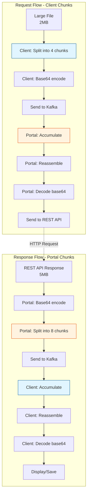

## Data Integrity with CRC32 Checksums

KafkaSend implements **bidirectional CRC32 checksum validation** to ensure end-to-end data integrity during chunked transfers. This protects against data corruption that may occur during:
- Message serialization/deserialization
- Network transmission through Kafka
- Chunk reassembly
- Base64 encoding/decoding

### Bidirectional Protection

CRC32 validation works in **both directions** with clear responsibilities:

| Direction | Who Calculates | Who Verifies | What Data | When |
|-----------|----------------|--------------|-----------|------|
| **Request** | Client | Portal | File/upload data | Before sending → After reassembly |
| **Response** | Portal | Client | REST API response | After receiving → Before processing |

This ensures **complete data integrity** from client through Kafka to portal to REST API and back.

---

## Request Direction: Client → Portal

### How It Works

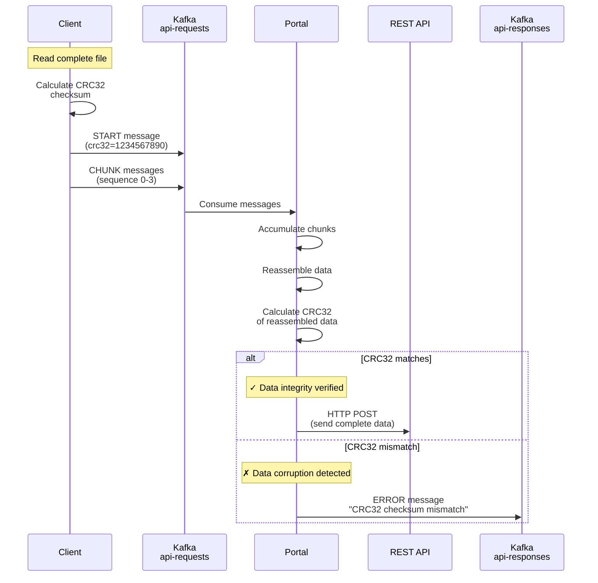

### Client Responsibilities (Request Direction)

The client is responsible for calculating CRC32 **before** sending data:

**1. Calculate checksum of complete file:**
```python
# In sender.py:86
crc = 0
with open(file_path, 'rb') as f:
    while chunk := f.read(65536):  # Read in 64KB chunks
        crc = zlib.crc32(chunk, crc)
file_crc32 = crc & 0xffffffff  # Unsigned 32-bit integer
```

**2. Include CRC32 in START message:**
```python
start_message = KafkaRequestMessage(
    job_id=job_id,
    message_type=MessageType.START,
    method=HttpMethod.POST,
    endpoint="/api/upload",
    filename="document.pdf",
    content_type="application/pdf",
    crc32=file_crc32,  # ← CRC32 of complete file
    total_chunks=4
)
```

**3. Handle CRC32 validation errors:**
- If portal detects mismatch, receives ERROR message
- Client should log error and may retry upload
- Indicates data corruption during transmission

### Portal Responsibilities (Request Direction)

The portal is responsible for verifying CRC32 **after** reassembling data:

**1. Store expected CRC32 from START message:**
```python
# In job_manager.py:154
job = JobState(
    job_id=message.job_id,
    method=message.method,
    endpoint=message.endpoint,
    expected_crc32=message.crc32,  # ← Store expected CRC32
    total_chunks=message.total_chunks
)
```

**2. Accumulate and reassemble chunks:**
```python
# In job_manager.py:164-165
chunk_data = decode_chunk(message.data)
job.add_chunk(message.sequence, chunk_data)
```

**3. Verify CRC32 after complete reassembly:**
```python
# In job_manager.py:85-105
def get_complete_data(self) -> bytes:
    # Reassemble all chunks
    sorted_chunks = [self.chunks[i] for i in sorted(self.chunks.keys())]
    complete_data = reassemble_chunks(sorted_chunks)

    # Verify CRC32 if provided
    if self.expected_crc32 is not None:
        actual_crc32 = zlib.crc32(complete_data) & 0xffffffff
        if actual_crc32 != self.expected_crc32:
            raise ValueError(
                f"CRC32 checksum mismatch for job {self.job_id}: "
                f"expected {self.expected_crc32}, got {actual_crc32}"
            )
    return complete_data
```

**4. Send error response on mismatch:**
- Portal automatically sends ERROR message to response topic
- Job is cancelled and cleaned up
- Client receives detailed error message

---

## Response Direction: Portal → Client

### How It Works

The portal calculates CRC32 checksums for **all** REST API responses and sends them back to the client for verification.

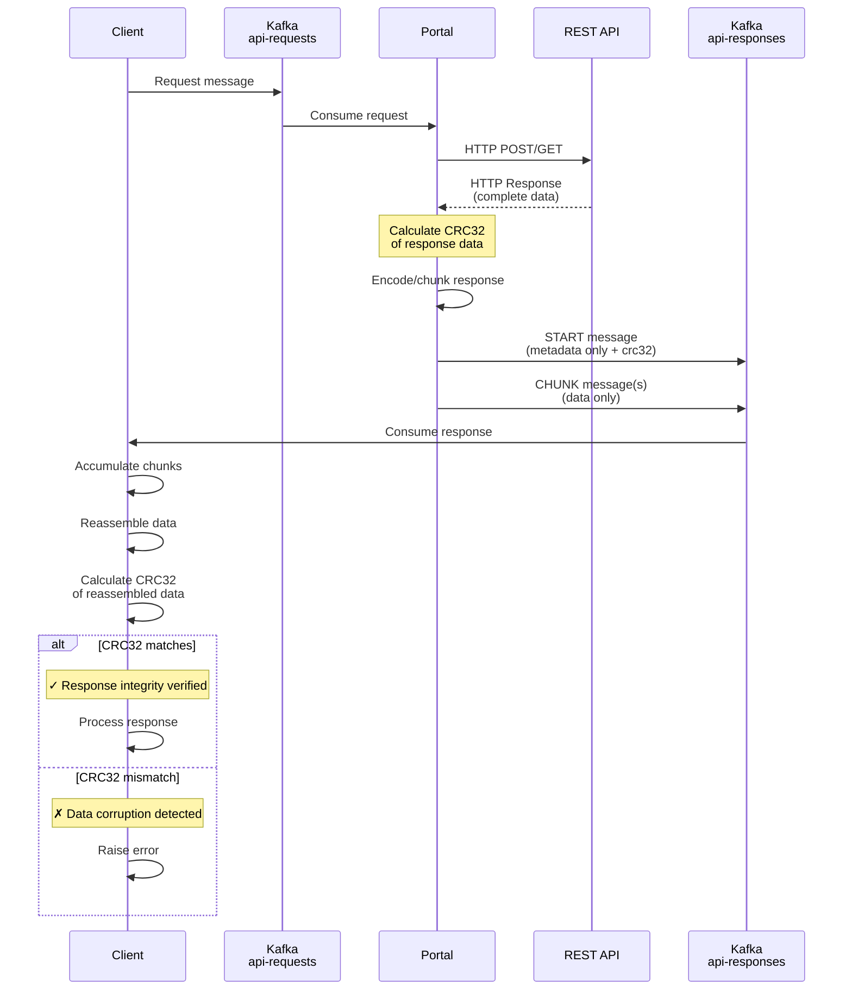

### Portal Responsibilities (Response Direction)

The portal is responsible for calculating CRC32 **after** receiving REST API response:

**1. Calculate CRC32 of complete HTTP response:**
```python
# In service.py:268
response_data = response.content  # Raw bytes from REST API
response_crc32 = zlib.crc32(response_data) & 0xffffffff
```

**2. Include CRC32 in START message:**
```python
# In service.py - START message (metadata only)
start_message = KafkaResponseMessage(
    job_id=job_id,
    message_type=MessageType.START,
    sequence=0,
    total_chunks=data_chunks,
    status_code=response.status_code,
    headers=dict(response.headers),
    is_text=is_text,
    crc32=response_crc32  # ← CRC32 of complete response
)
```

**3. Send CHUNK message(s) with data:**
```python
# CHUNK message (data only, no metadata)
chunk_message = KafkaResponseMessage(
    job_id=job_id,
    message_type=MessageType.CHUNK,
    sequence=i,
    total_chunks=data_chunks,
    data=chunk_data  # ← Data only
)
```

**4. Key points:**
- CRC32 included in **START message only** (along with other metadata)
- CHUNK messages contain only data (no metadata)
- Checksum represents complete response before chunking
- Pattern is consistent regardless of response size

**5. Log CRC32 for audit trail:**
```python
logger.info(
    "Response sent",
    job_id=job_id,
    status_code=response.status_code,
    crc32=response_crc32  # ← Logged for debugging
)
```

### Client Responsibilities (Response Direction)

The client is responsible for verifying CRC32 **after** reassembling response:

**1. Store expected CRC32 from first response message:**
```python
# In receiver.py:205-206
if response.crc32 is not None:
    state.expected_crc32 = response.crc32  # ← Store expected CRC32
```

**2. Accumulate response chunks:**
```python
# In receiver.py:212
if response.data:
    state.add_chunk(response.sequence, response.data)
```

**3. Verify CRC32 after complete reassembly:**
```python
# In receiver.py:57-79
def get_complete_data(self) -> str:
    # Reassemble chunks
    sorted_data = [self.chunks[i] for i in sorted(self.chunks.keys())]
    complete_data = ''.join(sorted_data)

    # Verify CRC32 if provided
    if self.expected_crc32 is not None:
        # For JSON: calculate CRC32 of UTF-8 bytes
        if self.is_text:
            raw_bytes = complete_data.encode('utf-8')
        # For binary: decode base64 first, then calculate
        else:
            import base64
            raw_bytes = base64.b64decode(complete_data)

        actual_crc32 = zlib.crc32(raw_bytes) & 0xffffffff

        if actual_crc32 != self.expected_crc32:
            raise ValueError(
                f"CRC32 checksum mismatch for response {self.job_id}: "
                f"expected {self.expected_crc32}, got {actual_crc32}"
            )
    return complete_data
```

**4. Handle CRC32 validation errors:**
- Client raises `ValueError` on mismatch
- Application should log error
- May indicate data corruption during transmission

---

## Summary of Responsibilities

### Complete Responsibility Matrix

| Component | Request Direction (Upload) | Response Direction (Download) |
|-----------|---------------------------|------------------------------|
| **Client** | ✓ Calculate CRC32 of file<br>✓ Send in START message<br>✓ Handle ERROR responses | ✓ Store CRC32 from response<br>✓ Verify after reassembly<br>✓ Raise error on mismatch |
| **Portal** | ✓ Store CRC32 from START<br>✓ Verify after reassembly<br>✓ Send ERROR on mismatch | ✓ Calculate CRC32 of REST response<br>✓ Send in response message<br>✓ Log for audit trail |

### Key Differences Between Directions

| Aspect | Request CRC32 (Client → Portal) | Response CRC32 (Portal → Client) |
|--------|--------------------------------|----------------------------------|
| **Calculated by** | Client (sender.py) | Portal (service.py) |
| **Verified by** | Portal (job_manager.py) | Client (receiver.py) |
| **Data type** | Always binary (files) | JSON or binary |
| **CRC32 scope** | Original file bytes | HTTP response content bytes |
| **In message** | START message | First response message |
| **Error handling** | Portal sends ERROR message | Client raises ValueError |

### CRC32 Calculation Details

**Request (Client):**
```python
# File bytes → CRC32
crc32 = zlib.crc32(file_bytes) & 0xffffffff
```

**Response - JSON (Portal):**
```python
# JSON text bytes → CRC32
json_bytes = '{"status": "ok"}'.encode('utf-8')
crc32 = zlib.crc32(json_bytes) & 0xffffffff
```

**Response - Binary (Portal):**
```python
# Binary bytes → CRC32 (before base64 encoding)
crc32 = zlib.crc32(binary_bytes) & 0xffffffff
```

### Important Notes

1. **CRC32 calculated on raw data**: Always calculated on the original bytes, not base64-encoded data
2. **Checksum covers complete data**: Not individual chunks, but the complete file/response
3. **Included in first message only**: START message for requests, first CHUNK/START for responses
4. **Backwards compatible**: Optional field, works without CRC32
5. **Performance**: Minimal overhead (~100ms for 50MB file)

---

## Benefits and Error Handling

### Benefits

- **End-to-end data integrity**: Verifies data from client → portal → REST API → portal → client
- **Corruption detection**: Catches bit flips, truncation, or reassembly errors
- **Bidirectional protection**: Both uploads and downloads verified
- **Debugging aid**: Identifies where corruption occurred (transmission vs processing)
- **Audit trail**: All CRC32 values logged for investigation
- **Optional**: Backwards compatible with clients that don't send CRC32

### Error Messages

**Request Direction (Portal detects corruption):**
```json
{
  "job_id": "abc-123",
  "message_type": "ERROR",
  "error_message": "CRC32 checksum mismatch for job abc-123: expected 1234567890, got 9876543210"
}
```

**Response Direction (Client detects corruption):**
```python
ValueError: CRC32 checksum mismatch for response abc-123: expected 1234567890, got 9876543210
```

### Recovery Actions

| Scenario | Action |
|----------|--------|
| Request CRC32 mismatch | Portal sends ERROR → Client logs error → Client may retry upload |
| Response CRC32 mismatch | Client raises exception → Application logs error → Application may retry request |
| Network corruption | CRC32 detects issue → Request/response rejected → Ensures data integrity |

### Testing

See comprehensive test coverage in:
- **`tests/test_crc32.py`**: Request and response CRC32 validation (12 tests)
- **`tests/test_portal_response_crc32.py`**: Portal response calculation logic (6 tests)

Test coverage includes:
- ✅ Valid CRC32 passes verification (requests and responses)
- ✅ Invalid CRC32 triggers error (requests and responses)
- ✅ Multi-chunk transfers verified correctly (requests and responses)
- ✅ JSON and binary responses handled correctly
- ✅ Large file chunking with CRC32 validation
- ✅ Empty responses and edge cases
- ✅ Unicode handling in JSON responses
- ✅ Jobs without CRC32 still work (backwards compatible)

## Multi-Instance Scaling with Partition Key Routing

KafkaSend supports running multiple portal instances for high availability and load distribution. To prevent multiple portals from processing chunks of the same job, we use **partition key routing** based on the job ID.

### How It Works

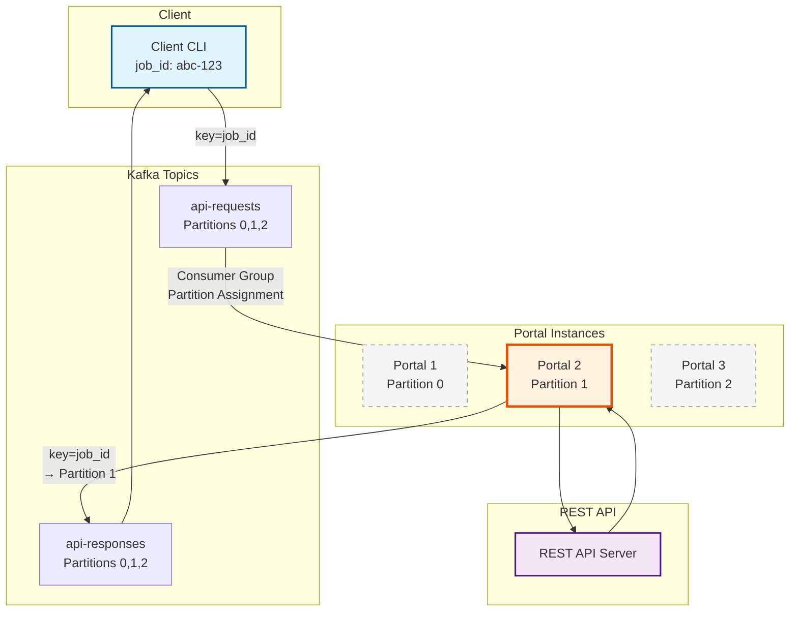

### Key Guarantees

1. **Job Affinity**: All messages with the same `job_id` are routed to the same Kafka partition using the job ID as the partition key
2. **Single Consumer**: Kafka's consumer group mechanism ensures each partition is assigned to only one portal instance
3. **Message Ordering**: Kafka guarantees message order within a partition, ensuring chunks arrive in sequence
4. **Load Distribution**: Different jobs (with different job IDs) are distributed across partitions and portal instances
5. **Fault Tolerance**: If a portal instance fails, Kafka rebalances partitions to surviving instances

### Implementation Details

**Client-side** (`sender.py`):
```python
self._producer.send(
    self.kafka_config.request_topic,
    key=message.job_id.encode('utf-8'),  # Partition key
    value=message.model_dump()
)
```

**Portal-side** (`service.py`):
```python
self._producer.send(
    self.kafka_config.response_topic,
    key=message.job_id.encode('utf-8'),  # Partition key
    value=message.model_dump()
)
```

### Benefits

- **Prevents Race Conditions**: No two portal instances will process chunks from the same job
- **Scalability**: Add more portal instances to handle increased load
- **High Availability**: Jobs automatically reassigned if an instance fails
- **Performance**: Jobs processed in parallel across multiple instances

### Configuration

To enable multi-instance deployment, simply run multiple portal containers with the same consumer group ID:

```yaml
# docker-compose.yml
portal-1:
  environment:
    KAFKA_CONSUMER_GROUP: portal-service-group  # Same group

portal-2:
  environment:
    KAFKA_CONSUMER_GROUP: portal-service-group  # Same group
```

## Protocol Flow

### Single-Chunk Upload (Small File)

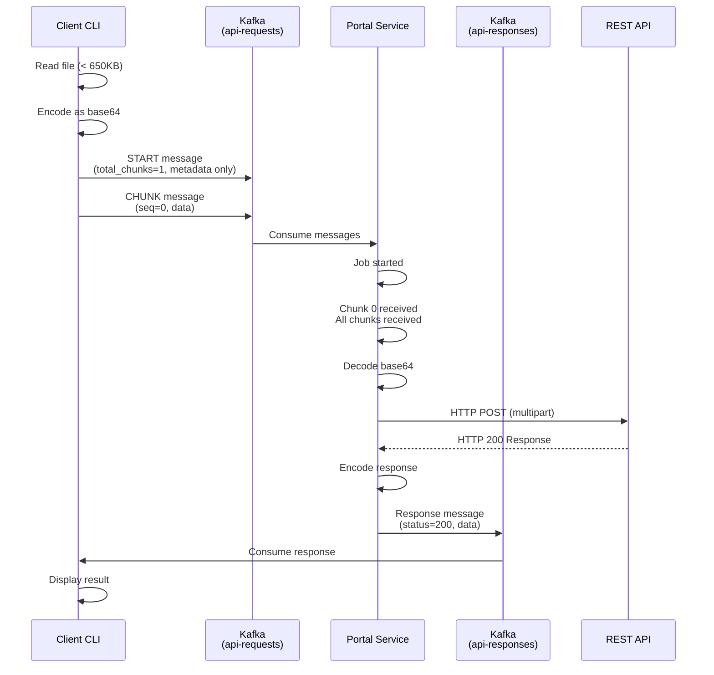

### Multi-Chunk Upload (Large File)

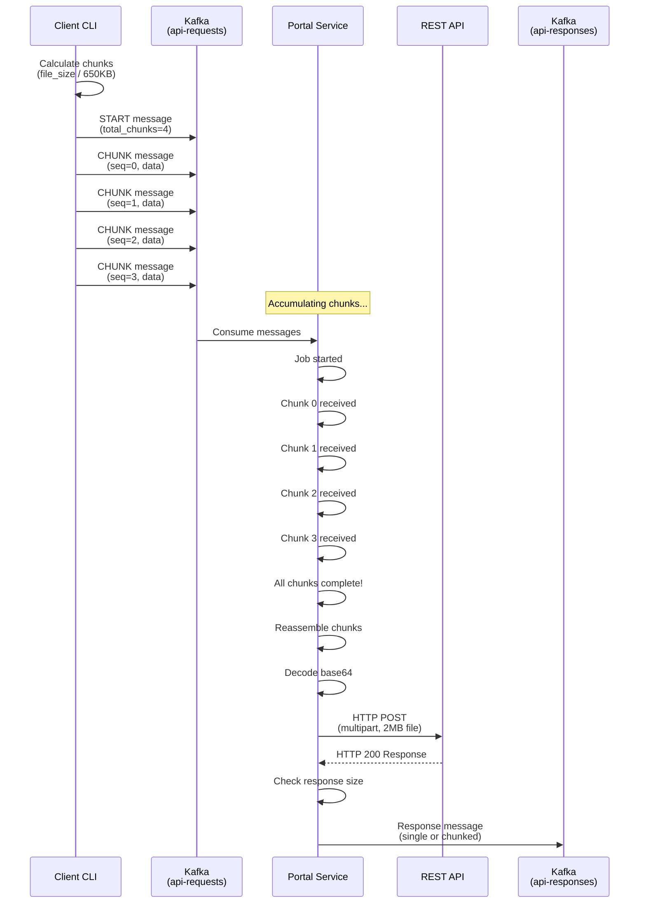

### Simple Request (No Body)

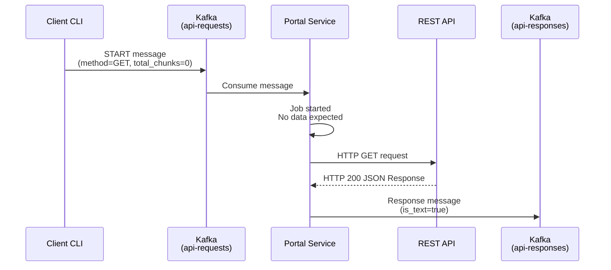

### Large Response Handling (Chunked by Portal)

When the REST API returns a large response (> 650KB), the portal automatically chunks it:

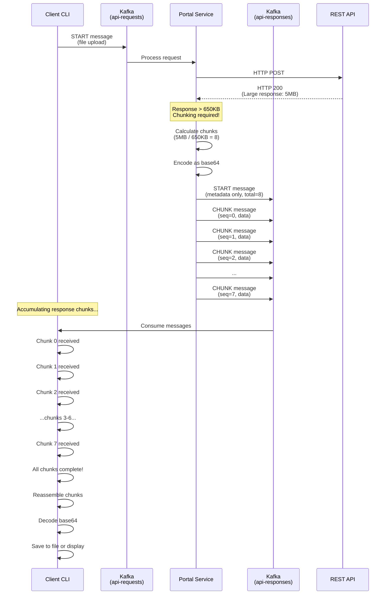

**Key Points:**
- **Portal responsibility**: Chunk large responses (> 650KB) before sending to Kafka
- **Client responsibility**: Reassemble response chunks in correct order
- **Same chunking logic**: Both request and response use 650KB chunks
- **Base64 encoding**: Applied to binary responses before chunking
- **Symmetric protocol**: Both directions use START message for metadata, CHUNK messages for data

### Error Handling

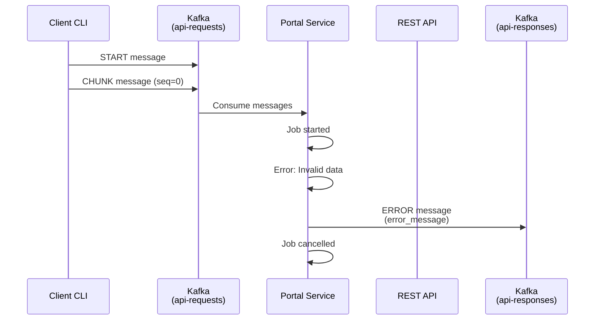

## Message Formats

### Request Message Schema

Clients send two types of messages to the `api-requests` topic: **START** and **CHUNK**.

**START Message - File Upload (POST/PUT with file) - Metadata Only:**
```json
{
  "job_id": "uuid-v4",
  "message_type": "START",
  "sequence": 0,
  "total_chunks": 4,
  "method": "POST",
  "endpoint": "/api/upload",
  "headers": {
    "X-Custom-Header": "value"
  },
  "filename": "document.pdf",
  "content_type": "application/pdf",
  "crc32": 1234567890
}
```

**Note:** START messages never contain data. Data is always sent in separate CHUNK messages, even for small files with `total_chunks=1`.

**START Message - Simple Request (GET/DELETE with no body):**
```json
{
  "job_id": "uuid-v4",
  "message_type": "START",
  "sequence": 0,
  "total_chunks": 0,
  "method": "GET",
  "endpoint": "/api/documents/123",
  "headers": {
    "X-Custom-Header": "value"
  }
}
```

**CHUNK Message (data only, follows START):**
```json
{
  "job_id": "uuid-v4",
  "message_type": "CHUNK",
  "sequence": 0,
  "total_chunks": 4,
  "data": "base64-encoded-binary-data"
}
```

### Response Message Schema

All response messages sent to the `api-responses` topic follow this schema:

**START Message (metadata only):**
```json
{
  "job_id": "uuid-v4",
  "message_type": "START",
  "sequence": 0,
  "total_chunks": 1,  // Number of CHUNK messages to follow
  "status_code": 200,
  "headers": {
    "Content-Type": "application/json",
    "Content-Length": "1234"
  },
  "is_text": true,
  "crc32": 9876543210,
  "data": null  // Always null in START messages
}
```

**CHUNK Message (data only):**
```json
{
  "job_id": "uuid-v4",
  "message_type": "CHUNK",
  "sequence": 0,
  "total_chunks": 1,
  "data": "base64-or-plain-text"  // Actual response data
}
```

**ERROR Message:**
```json
{
  "job_id": "uuid-v4",
  "message_type": "ERROR",
  "error_message": "Error description"
}
```

## Detailed Message Types

### START Message (Request)

Initiates a new job and provides all metadata needed for the HTTP request.

**Required Fields:**
- `job_id` - Unique identifier (UUID v4)
- `message_type` = `"START"`
- `sequence` = `0`
- `total_chunks` - Number of chunks to expect (0 if no body)
- `method` - HTTP method
- `endpoint` - Target API path

**Optional Fields:**
- `headers` - HTTP headers (content-type, etc.)
- `filename` - Original filename for multipart uploads
- `content_type` - MIME type of the file
- `crc32` - CRC32 checksum of complete data for integrity verification (unsigned 32-bit integer)
- `data` - Not used in START messages (always null/omitted; data sent in CHUNK messages)

**Example - Small File Upload (START message - metadata only):**
```json
{
  "job_id": "a7cf937b-b8ca-41e5-a9d1-e380bc726dea",
  "message_type": "START",
  "sequence": 0,
  "total_chunks": 1,
  "method": "POST",
  "endpoint": "/api/upload",
  "headers": {},
  "filename": "test.txt",
  "content_type": "text/plain",
  "crc32": 2870671212
}
```

**Followed by CHUNK message with data:**
```json
{
  "job_id": "a7cf937b-b8ca-41e5-a9d1-e380bc726dea",
  "message_type": "CHUNK",
  "sequence": 0,
  "total_chunks": 1,
  "data": "VGhpcyBpcyBhIHRlc3QgZmlsZSBmb3IgZGVtb25zdHJhdGlvbiBwdXJwb3Nlcy4K"
}
```

**Example - Large File Upload (Start):**
```json
{
  "job_id": "c51e5e4f-bba9-470e-956e-ba190bac31ad",
  "message_type": "START",
  "sequence": 0,
  "total_chunks": 4,
  "method": "POST",
  "endpoint": "/api/upload",
  "headers": {},
  "filename": "large-file.bin",
  "content_type": "application/octet-stream",
  "crc32": 3456789012
}
```

**Example - GET Request (No Body):**
```json
{
  "job_id": "def456...",
  "message_type": "START",
  "sequence": 0,
  "total_chunks": 0,
  "method": "GET",
  "endpoint": "/api/status",
  "headers": {}
}
```

### CHUNK Message (Request)

Carries a chunk of binary data, base64 encoded.

**Required Fields:**
- `job_id` - Matches the START message
- `message_type` = `"CHUNK"`
- `sequence` - Chunk sequence number (0-indexed)
- `total_chunks` - Same as START message
- `data` - Base64 encoded binary chunk

**Optional Fields:**
- None

**Example:**
```json
{
  "job_id": "c51e5e4f-bba9-470e-956e-ba190bac31ad",
  "message_type": "CHUNK",
  "sequence": 1,
  "total_chunks": 4,
  "data": "iVBORw0KGgoAAAANSUhEUgAA..."
}
```

**Chunk Size Calculation:**
- Maximum chunk size: **650 KB** (before encoding)
- After base64 encoding: ~866 KB
- Plus JSON overhead: ~870 KB total message size
- Well under Kafka's 1 MB default limit

### Response Messages

The portal sends response messages back on the `api-responses` topic.

**Example - Success Response (2 messages):**

START message (metadata):
```json
{
  "job_id": "a7cf937b-b8ca-41e5-a9d1-e380bc726dea",
  "message_type": "START",
  "sequence": 0,
  "total_chunks": 1,
  "status_code": 200,
  "headers": {
    "Content-Type": "application/json",
    "Content-Length": "361"
  },
  "is_text": true,
  "crc32": 2847563921,
  "data": null
}
```

CHUNK message (data):
```json
{
  "job_id": "a7cf937b-b8ca-41e5-a9d1-e380bc726dea",
  "message_type": "CHUNK",
  "sequence": 0,
  "total_chunks": 1,
  "data": "{\"message\":\"File uploaded successfully\",\"filename\":\"test.txt\",\"size\":48}"
}
```

**Example - Error Response:**
```json
{
  "job_id": "abc123...",
  "message_type": "ERROR",
  "error_message": "'str' object has no attribute 'value'"
}
```

## Job State Machine

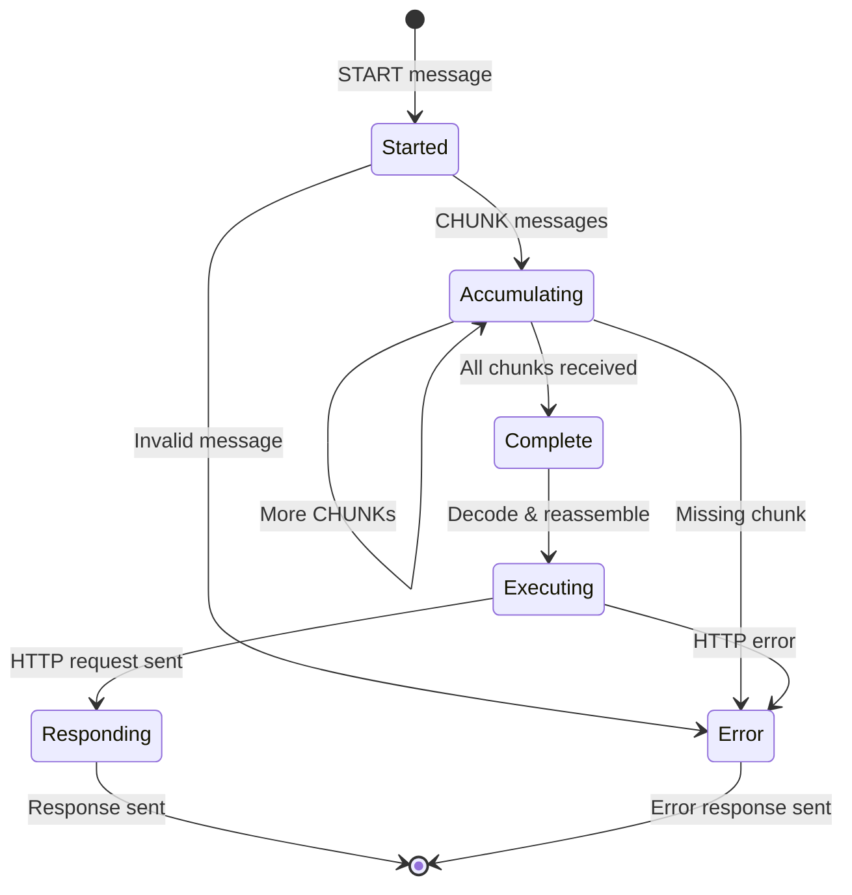

## Portal Processing Logic

### Job Initialization

1. Receive START message
2. Validate required fields (method, endpoint)
3. Create job state with metadata
4. If `total_chunks` = 0: execute immediately
5. If `total_chunks` > 0: wait for chunks

### Chunk Accumulation

1. Receive CHUNK messages
2. Validate job exists
3. Store chunk at sequence index
4. Check if all chunks received
5. When complete: proceed to execution

### Request Execution

1. Decode all base64 chunks
2. Reassemble into complete binary data
3. **Verify CRC32 checksum** (if provided in START message):
   - Calculate CRC32 of reassembled data
   - Compare with expected CRC32 from START message
   - If mismatch: reject request with error
4. Build HTTP request:
   - If `filename` present: multipart/form-data upload
   - Otherwise: raw body data
5. Add OAuth2 token (if configured)
6. Send HTTP request to target API
7. Wait for response (with timeout)

### Response Handling

**Portal responsibilities (chunking large responses):**

1. Receive HTTP response from REST API
2. **Determine content encoding:**
   - Text-based content types (sent as plain UTF-8 text):
     - `application/json`
     - `text/plain`
     - `text/html`
     - `text/xml` / `application/xml`
     - `text/css`, `text/javascript`, `application/javascript`
   - Binary content types (base64 encoded):
     - `application/pdf`, `application/octet-stream`, `image/*`, etc.
3. **Calculate response size and send messages:**
   - Always send START message (metadata only: status code, headers, CRC32, total_chunks, is_text)
   - Always send CHUNK message(s) with data
   - Split into 650KB chunks if response > 650KB
4. Flush all messages to `api-responses` topic
5. Complete job and cleanup

**Client responsibilities (reassembling responses):**

1. Listen on `api-responses` topic for matching job_id
2. Accumulate CHUNK messages by sequence number
3. Track progress (chunks_received / total_chunks)
4. When all chunks received:
   - Sort chunks by sequence number
   - Concatenate chunk data
   - Decode base64 (if binary)
   - Parse JSON (if is_text=true)
5. Display or save complete response
6. Close consumer connection

## Error Conditions

| Error | Cause | Recovery |
|-------|-------|----------|
| `MessageSizeTooLargeError` | Chunk exceeds 1MB after encoding | Reduce `MAX_CHUNK_SIZE` |
| `JobNotFound` | CHUNK received before START | Client should retry |
| `MissingChunks` | Not all chunks received | Timeout, send ERROR response |
| `InvalidData` | Base64 decode fails | Send ERROR response |
| `CRC32Mismatch` | Data corruption during transfer | Client should retry |
| `HTTPError` | Target API returns error | Return error status to client |
| `Timeout` | Request takes too long | Send ERROR response |
| `MaxJobsExceeded` | Too many concurrent jobs | Client should retry later |

## Configuration

### Kafka Topics

- **Request Topic**: `api-requests` (configurable via `KAFKA_REQUEST_TOPIC`)
- **Response Topic**: `api-responses` (configurable via `KAFKA_RESPONSE_TOPIC`)

### Size Limits

- **Max Chunk Size**: 650 KB (before base64 encoding)
- **Max File Size**: Unlimited (chunked automatically)
- **Kafka Message Limit**: 1 MB (default)
- **Max Request Size**: Configurable on producer (`max_request_size`)

### Timeouts

KafkaSend implements multiple timeout layers to handle long-running REST API requests (up to 15 minutes) while maintaining Kafka consumer health.

#### HTTP Request Timeout

- **Default**: 900 seconds (15 minutes)
- **Environment Variable**: `PORTAL_JOB_TIMEOUT_SECONDS`
- **Purpose**: Maximum time to wait for REST API response
- **Behavior**: If REST API doesn't respond within this time, request fails with timeout error

```python
# config.py
job_timeout_seconds: int = 900  # 15 minutes
```

#### Job Cleanup Timeout

- **Default**: 900 seconds (15 minutes)
- **Environment Variable**: `PORTAL_JOB_MAX_AGE_SECONDS`
- **Purpose**: Maximum age of a job before it's cleaned up as stale
- **Behavior**: Portal checks every 60 seconds and removes jobs older than this limit
- **Response**: Sends ERROR message back to client with timeout reason

```python
# config.py
job_max_age_seconds: int = 900  # 15 minutes
```

#### Kafka Consumer Timeouts

**Session Timeout:**
- **Default**: 300000 ms (5 minutes)
- **Environment Variable**: `KAFKA_SESSION_TIMEOUT_MS`
- **Purpose**: How long before consumer is considered dead by broker
- **Requirement**: Must send heartbeats within this interval

**Max Poll Interval:**
- **Default**: 1200000 ms (20 minutes)
- **Environment Variable**: `KAFKA_MAX_POLL_INTERVAL_MS`
- **Purpose**: Maximum time between poll() calls before consumer is kicked out
- **Requirement**: Must be longer than `job_timeout_seconds` to allow for long REST requests
- **Why 20 minutes**: Allows 15-minute request + 5-minute buffer

**Request Timeout:**
- **Default**: 120000 ms (2 minutes)
- **Environment Variable**: `KAFKA_REQUEST_TIMEOUT_MS`
- **Purpose**: Timeout for individual Kafka producer/consumer operations

```python
# config.py
session_timeout_ms: int = 300000        # 5 minutes
max_poll_interval_ms: int = 1200000     # 20 minutes
request_timeout_ms: int = 120000        # 2 minutes
```

#### Timeout Interaction

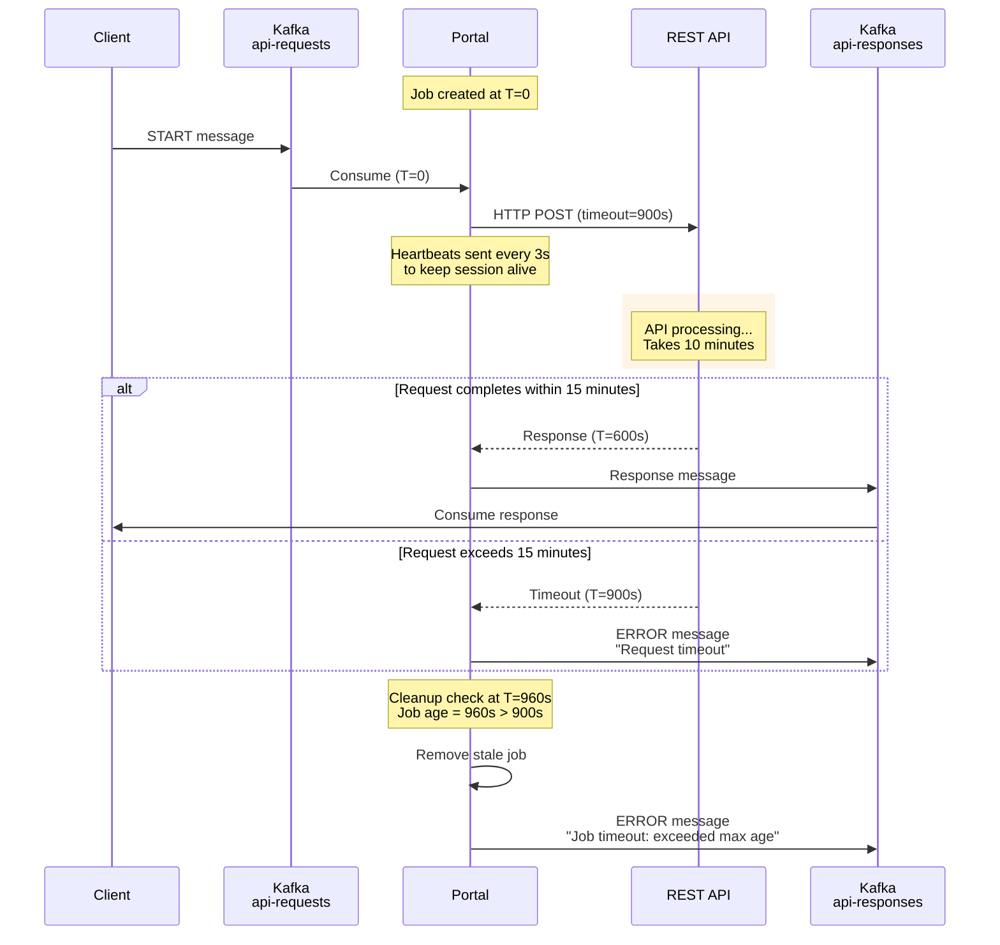

#### Configuration Guidelines

For long-running REST APIs:

1. **Set HTTP timeout** based on expected API response time:
   ```bash
   PORTAL_JOB_TIMEOUT_SECONDS=900  # 15 minutes
   ```

2. **Set job cleanup timeout** same or slightly higher than HTTP timeout:
   ```bash
   PORTAL_JOB_MAX_AGE_SECONDS=900  # 15 minutes
   ```

3. **Set max poll interval** higher than job timeout:
   ```bash
   KAFKA_MAX_POLL_INTERVAL_MS=1200000  # 20 minutes (15 min + buffer)
   ```

4. **Keep session timeout reasonable** for failure detection:
   ```bash
   KAFKA_SESSION_TIMEOUT_MS=300000  # 5 minutes
   ```

#### Timeout Error Messages

Clients may receive timeout errors in the following scenarios:

| Scenario | Error Message | Cause |
|----------|--------------|-------|
| HTTP timeout | `Request timeout: The read operation timed out` | REST API didn't respond within `job_timeout_seconds` |
| Job cleanup | `Job timeout: Job exceeded max age: 905.3s > 900s` | Job existed longer than `job_max_age_seconds` |
| Network issue | `Connection timeout` | Unable to connect to REST API |

## Best Practices

### For Clients

1. **Generate unique job IDs** using UUID v4
2. **Calculate chunks correctly** using `calculate_chunk_count()`
3. **Send START message first** before any CHUNKs
4. **Sequence chunks properly** starting from 0
5. **Handle timeouts gracefully** and retry if needed

### For Portal

1. **Validate all incoming messages** before processing
2. **Track job state carefully** to detect missing chunks
3. **Clean up completed jobs** to prevent memory leaks
4. **Log all operations** for debugging
5. **Handle OAuth token refresh** proactively

### For API Servers

1. **Support multipart/form-data** for file uploads
2. **Return JSON responses** when possible (easier to handle)
3. **Include proper status codes** (200, 400, 500, etc.)
4. **Handle large files efficiently** (streaming, etc.)
5. **Implement authentication** (Bearer tokens, etc.)

## Security Considerations

KafkaSend implements multiple security layers to prevent abuse of the portal service by compromised or malicious clients.

### Threat Model

The primary security concerns are:

1. **SSRF (Server-Side Request Forgery)**: Malicious clients using the portal to access internal services, cloud metadata endpoints, or perform network scanning
2. **Header Injection**: Clients injecting malicious headers or overriding OAuth headers
3. **Endpoint Abuse**: Clients accessing unintended API endpoints
4. **Data Exfiltration**: Using the portal to proxy requests to arbitrary destinations

### Security Controls

#### 1. Endpoint Whitelisting

The portal validates all requested endpoints against a configurable whitelist.

**Configuration:**
```bash
# Comma-separated list of allowed endpoint patterns (supports wildcards)
PORTAL_ALLOWED_ENDPOINTS="/api/upload,/api/documents/*,/v1/*/process"
```

**Behavior:**
- Exact matches: `/api/upload` allows only that specific endpoint
- Wildcard patterns: `/api/documents/*` allows `/api/documents/123`, `/api/documents/xyz/view`
- Empty string in strict mode: Blocks all requests (secure default)
- Empty string in permissive mode: Allows all (NOT RECOMMENDED for production)

**Example:**
```python
# Valid requests
/api/upload                    # Exact match
/api/documents/123             # Wildcard match
/api/documents/abc/metadata    # Wildcard match

# Blocked requests
/admin/users                   # Not in whitelist
/api/delete-all                # Not in whitelist
```

#### 2. Header Whitelisting

The portal filters client headers, only allowing specific headers through to the target API.

**Configuration:**
```bash
# Comma-separated list of allowed header names (case-insensitive)
PORTAL_ALLOWED_HEADERS="Content-Type,Accept,X-Request-ID,X-Correlation-ID"
```

**Forbidden Headers (Always Blocked):**
- `Authorization` - OAuth tokens managed by portal, not clients
- `Proxy-Authorization` - Proxy auth should not be controllable by clients
- `Cookie` - Session cookies should not be forwarded
- `X-Forwarded-For` - Network routing headers
- `X-Real-IP` - Network routing headers
- `Host` - Target host controlled by portal configuration

**Behavior:**
- Case-insensitive matching: `Content-Type`, `content-type`, `CONTENT-TYPE` all match
- Forbidden headers always blocked regardless of whitelist
- Unknown headers silently removed
- Empty whitelist: Blocks all client headers (recommended default)

#### 3. SSRF Protection

The portal automatically blocks known SSRF target patterns:

**Blocked Patterns:**
- `127.0.0.1` / `localhost` / `::1` - Loopback addresses
- `169.254.169.254` - AWS/Azure/GCP metadata endpoints
- `0.0.0.0` - Any address
- `10.*.*.*` - Private network (Class A)
- `172.16.*.*` through `172.31.*.*` - Private network (Class B)
- `192.168.*.*` - Private network (Class C)
- `*.local` / `*.internal` - Internal DNS names

**Note:** SSRF checks are applied to the endpoint path, not the target API base URL (which is controlled by `PORTAL_TARGET_API_URL`).

#### 4. Strict Mode

Controls whether validation failures block requests or only log warnings.

**Configuration:**
```bash
PORTAL_STRICT_SECURITY=true  # Recommended for production
```

**Strict Mode (true):**
- Invalid endpoints → Request rejected with error
- No whitelist configured → All requests rejected
- Security violation → Logged and blocked

**Permissive Mode (false):**
- Invalid endpoints → Logged as warning, request allowed
- No whitelist → Logged as warning, all requests allowed
- **Use only for development/testing**

### Security Configuration Examples

#### Production (Secure)

```bash
# Strict whitelist for specific endpoints
PORTAL_ALLOWED_ENDPOINTS="/api/v1/upload,/api/v1/documents/*"
PORTAL_ALLOWED_HEADERS="Content-Type,X-Request-ID"
PORTAL_STRICT_SECURITY=true
```

#### Development (Less Strict)

```bash
# Broader whitelist for testing
PORTAL_ALLOWED_ENDPOINTS="/api/*"
PORTAL_ALLOWED_HEADERS="Content-Type,Accept,X-Debug-*"
PORTAL_STRICT_SECURITY=true
```

#### Testing (Permissive - NOT for Production)

```bash
# Allow all endpoints and headers (insecure)
PORTAL_ALLOWED_ENDPOINTS=""
PORTAL_ALLOWED_HEADERS=""
PORTAL_STRICT_SECURITY=false
```

### Security Logging

All security events are logged with structured logging:

```json
{
  "event": "security_validation",
  "job_id": "abc-123",
  "endpoint": "/admin/users",
  "result": "blocked",
  "reason": "Endpoint '/admin/users' not in whitelist: ['/api/upload', '/api/documents/*']"
}
```

**Logged Events:**
- Endpoint validation failures
- Header filtering (removed headers)
- SSRF attempt detection
- Forbidden header blocking
- Security configuration warnings

### Additional Security Best Practices

- **Job IDs are UUIDs**: Hard to guess, provides isolation between jobs
- **OAuth2 tokens**: Managed by portal, clients cannot override
- **No data persistence**: Chunks stored in memory only, no disk traces
- **Kafka ACLs**: Configure Kafka topic ACLs for production
- **TLS/SSL**: Enable for production Kafka and HTTP traffic
- **Network isolation**: Run portal in isolated network segment
- **Rate limiting**: Consider implementing rate limits per client
- **Audit logging**: Enable comprehensive audit logs for compliance

### Security Testing

Test security controls before production deployment:

```bash
# Test 1: Attempt to access blocked endpoint
# Expected: Request rejected

# Test 2: Send forbidden headers (Authorization, Cookie)
# Expected: Headers silently removed

# Test 3: Try SSRF targets (localhost, 169.254.169.254)
# Expected: Request rejected with SSRF warning

# Test 4: Verify whitelist patterns work correctly
# Expected: Only whitelisted endpoints succeed
```

See `tests/test_security.py` for comprehensive security test cases.

## Performance Characteristics

### Throughput

- **Small files (< 650KB)**: Single message, low latency
- **Large files (2-50MB)**: Multiple chunks, higher latency
- **Chunk processing**: ~100ms per chunk
- **HTTP request**: Depends on target API

### Scalability

- **Concurrent jobs**: Limited by `PORTAL_MAX_CONCURRENT_JOBS` (default: 10)
- **Kafka partitions**: Can parallelize across multiple portal instances
- **Consumer groups**: Each portal joins same group for load balancing

## Limitations

- **Consumer offset timing**: Response waiting may fail due to consumer group coordination
- **In-memory storage**: Large files consume portal memory
- **No persistence**: Failed jobs are lost
- **Synchronous processing**: One job at a time per portal instance

## Future Enhancements

- **Async response handling**: Decouple request and response processing
- **Persistent storage**: Store chunks in Redis/S3 for large files
- **Retry logic**: Automatic retry on transient failures
- **Compression**: Compress chunks before base64 encoding
- **Streaming**: Stream large responses back without accumulation
