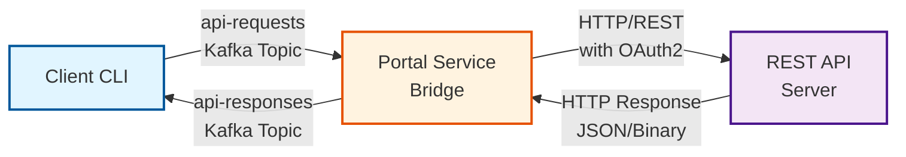
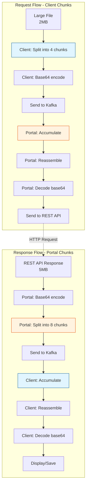
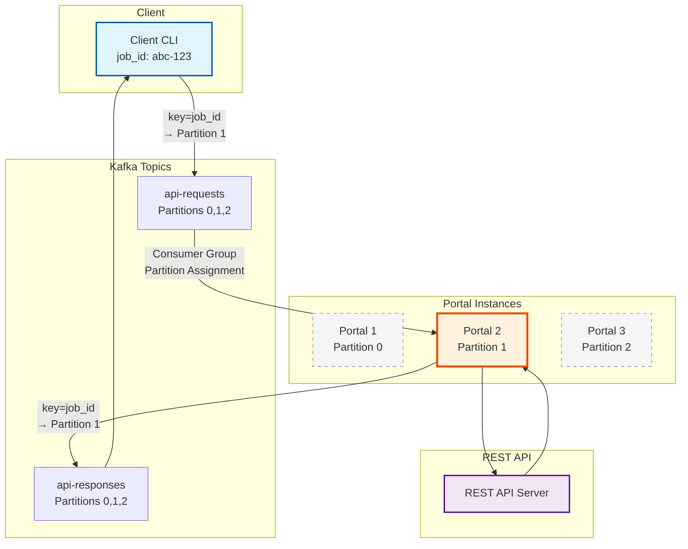
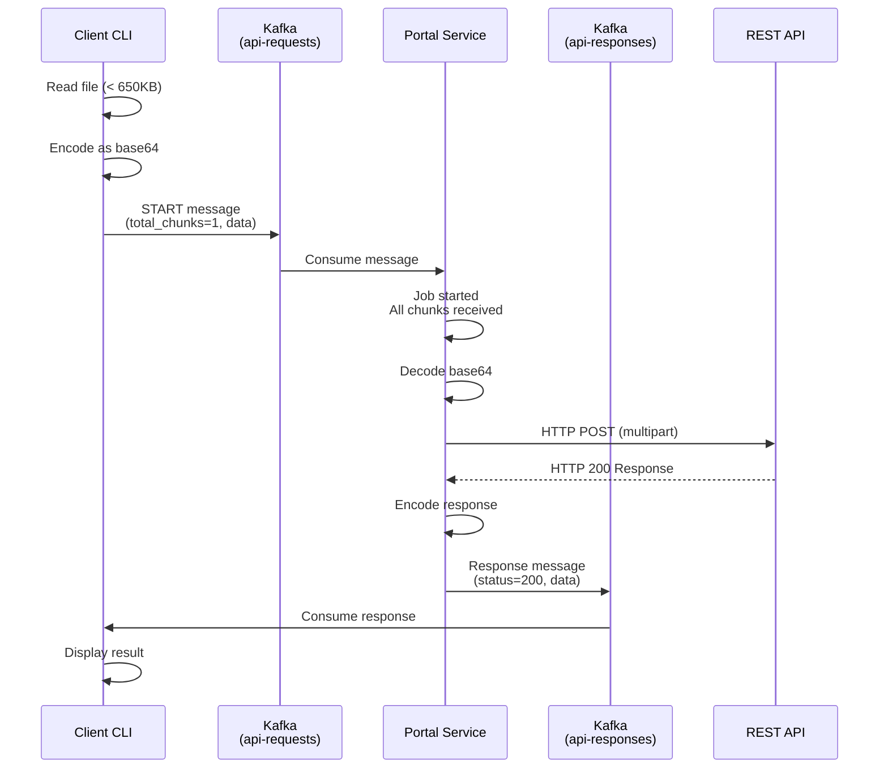
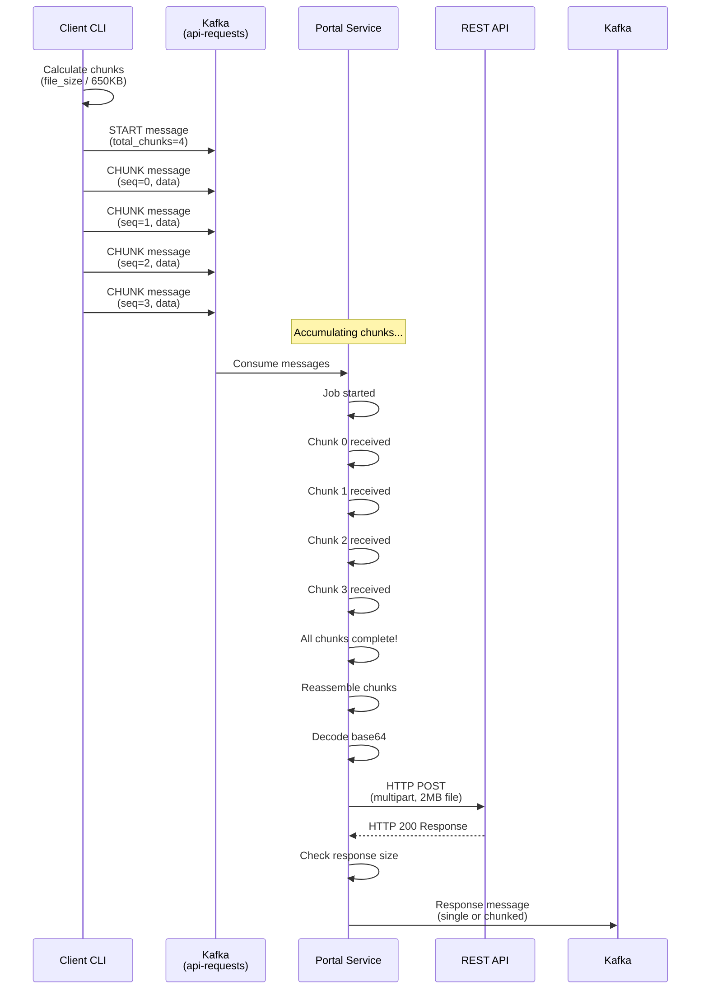
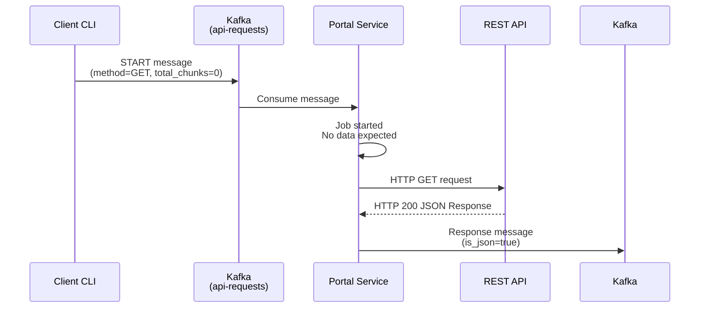
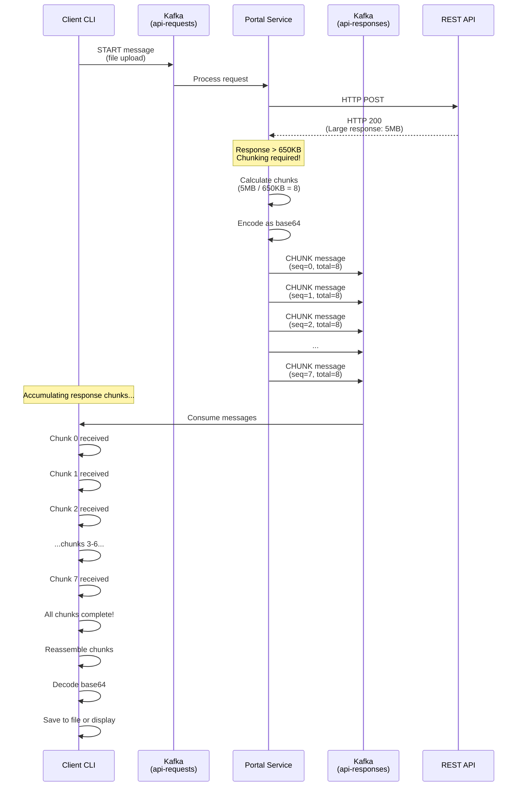
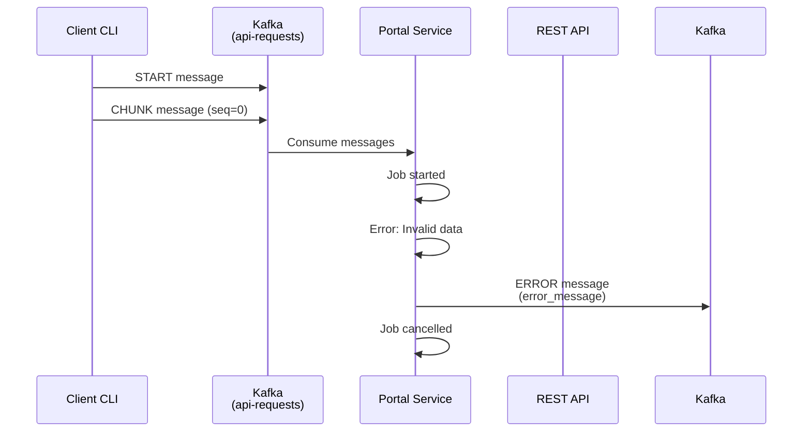
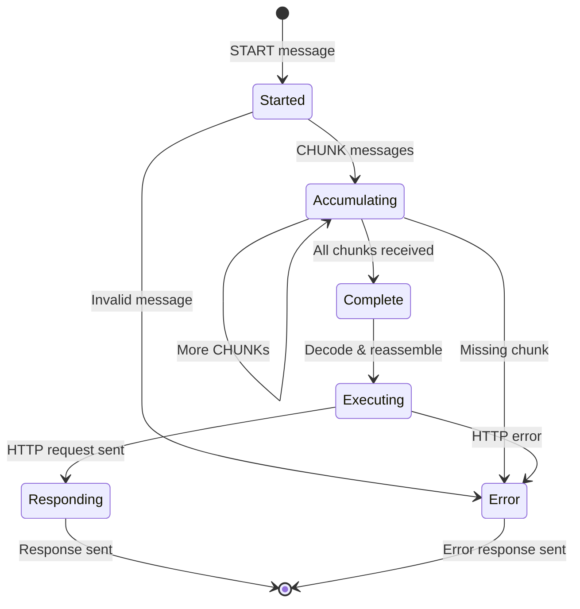
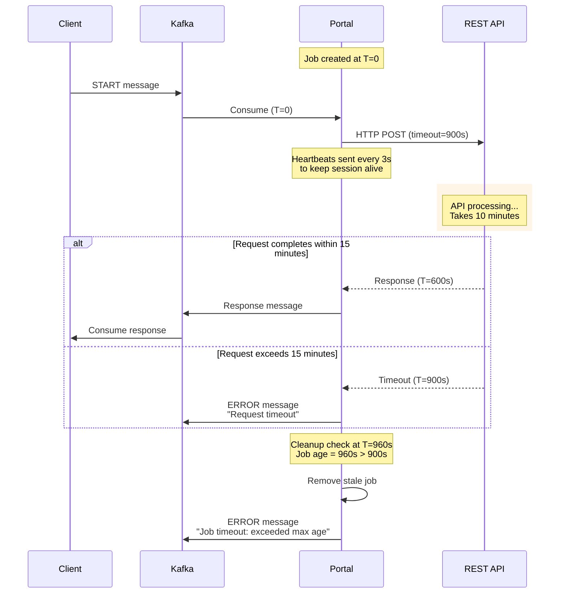

# KafkaSend Protocol Specification

This document describes the message protocol used by KafkaSend to transmit files and HTTP requests through Kafka topics.

## Overview

KafkaSend uses a chunked message protocol to enable large file transfers (up to 50MB+) through Kafka, which has message size limitations. The protocol supports:

- Multi-chunk file transfers with sequence ordering
- Job-based request/response correlation
- Multiple HTTP methods (GET, POST, PUT, PATCH, DELETE)
- Custom headers and multipart file uploads
- Error handling and status reporting

## Architecture



## Message Types

The protocol defines four message types:

| Type | Purpose |
|------|---------|
| `START` | Initiates a new job with metadata and configuration |
| `CHUNK` | Carries a chunk of binary data (base64 encoded) |
| `END` | Optional completion marker for requests with no data |
| `ERROR` | Reports errors during processing |

## Bidirectional Chunking

The KafkaSend protocol implements **bidirectional chunking** to handle large data in both directions:

### Request Direction: Client → Portal

**Client responsibilities:**
- Calculate chunk count based on file size
- Split large files into 650KB chunks
- Base64 encode each chunk
- Send START message followed by CHUNK messages
- Include sequence numbers and total chunk count

**Portal responsibilities:**
- Receive and accumulate chunks in memory
- Track sequence numbers to ensure all chunks received
- Reassemble chunks in correct order
- Decode base64 back to binary
- Forward complete data to REST API

### Response Direction: Portal → Client

**Portal responsibilities:**
- Receive HTTP response from REST API
- Check response size (> 650KB requires chunking)
- Base64 encode binary responses
- Split large responses into 650KB chunks
- Send CHUNK messages with sequence numbers
- Include status code and headers in first message

**Client responsibilities:**
- Receive and accumulate response chunks
- Track sequence numbers to ensure all chunks received
- Reassemble chunks in correct order
- Decode base64 back to binary/text
- Display or save the complete response

### Key Characteristics

| Aspect | Request Chunking | Response Chunking |
|--------|------------------|-------------------|
| **Who chunks?** | Client | Portal |
| **Who reassembles?** | Portal | Client |
| **Chunk size** | 650KB (before base64) | 650KB (before base64) |
| **When needed?** | Files > 650KB | Responses > 650KB |
| **Encoding** | Base64 | Base64 |
| **Message types** | START + CHUNKs | START/CHUNKs |



## Multi-Instance Scaling with Partition Key Routing

KafkaSend supports running multiple portal instances for high availability and load distribution. To prevent multiple portals from processing chunks of the same job, we use **partition key routing** based on the job ID.

### How It Works



### Key Guarantees

1. **Job Affinity**: All messages with the same `job_id` are routed to the same Kafka partition using the job ID as the partition key
2. **Single Consumer**: Kafka's consumer group mechanism ensures each partition is assigned to only one portal instance
3. **Message Ordering**: Kafka guarantees message order within a partition, ensuring chunks arrive in sequence
4. **Load Distribution**: Different jobs (with different job IDs) are distributed across partitions and portal instances
5. **Fault Tolerance**: If a portal instance fails, Kafka rebalances partitions to surviving instances

### Implementation Details

**Client-side** (`sender.py`):
```python
self._producer.send(
    self.kafka_config.request_topic,
    key=message.job_id.encode('utf-8'),  # Partition key
    value=message.model_dump()
)
```

**Portal-side** (`service.py`):
```python
self._producer.send(
    self.kafka_config.response_topic,
    key=message.job_id.encode('utf-8'),  # Partition key
    value=message.model_dump()
)
```

### Benefits

- **Prevents Race Conditions**: No two portal instances will process chunks from the same job
- **Scalability**: Add more portal instances to handle increased load
- **High Availability**: Jobs automatically reassigned if an instance fails
- **Performance**: Jobs processed in parallel across multiple instances

### Configuration

To enable multi-instance deployment, simply run multiple portal containers with the same consumer group ID:

```yaml
# docker-compose.yml
portal-1:
  environment:
    KAFKA_CONSUMER_GROUP: portal-service-group  # Same group

portal-2:
  environment:
    KAFKA_CONSUMER_GROUP: portal-service-group  # Same group
```

## Protocol Flow

### Single-Chunk Upload (Small File)



### Multi-Chunk Upload (Large File)



### Simple Request (No Body)



### Large Response Handling (Chunked by Portal)

When the REST API returns a large response (> 650KB), the portal automatically chunks it:



**Key Points:**
- **Portal responsibility**: Chunk large responses (> 650KB) before sending to Kafka
- **Client responsibility**: Reassemble response chunks in correct order
- **Same chunking logic**: Both request and response use 650KB chunks
- **Base64 encoding**: Applied to binary responses before chunking

### Error Handling



## Message Formats

### Request Message Schema

All request messages sent to the `api-requests` topic follow this schema:

```json
{
  "job_id": "uuid-v4",
  "message_type": "START|CHUNK|END|ERROR",
  "sequence": 0,
  "total_chunks": 4,

  // HTTP Request Details (START message only)
  "method": "POST|GET|PUT|PATCH|DELETE",
  "endpoint": "/api/upload",
  "headers": {
    "Authorization": "Bearer token",
    "X-Custom-Header": "value"
  },

  // File Details (START message only)
  "filename": "document.pdf",
  "content_type": "application/pdf",

  // Data (START and CHUNK messages)
  "data": "base64-encoded-binary-data",

  // Error Details (ERROR message only)
  "error_message": "Error description"
}
```

### Response Message Schema

All response messages sent to the `api-responses` topic follow this schema:

```json
{
  "job_id": "uuid-v4",
  "message_type": "START|CHUNK|ERROR",
  "sequence": 0,
  "total_chunks": 1,

  // HTTP Response Details
  "status_code": 200,
  "headers": {
    "Content-Type": "application/json",
    "Content-Length": "1234"
  },

  // Response Data
  "data": "base64-or-plain-text",
  "is_json": true,

  // Error Details (ERROR message only)
  "error_message": "Error description"
}
```

## Detailed Message Types

### START Message (Request)

Initiates a new job and provides all metadata needed for the HTTP request.

**Required Fields:**
- `job_id` - Unique identifier (UUID v4)
- `message_type` = `"START"`
- `sequence` = `0`
- `total_chunks` - Number of chunks to expect (0 if no body)
- `method` - HTTP method
- `endpoint` - Target API path

**Optional Fields:**
- `headers` - HTTP headers (auth, content-type, etc.)
- `filename` - Original filename for multipart uploads
- `content_type` - MIME type of the file
- `data` - Base64 encoded data (if `total_chunks` = 1)

**Example - Small File Upload:**
```json
{
  "job_id": "a7cf937b-b8ca-41e5-a9d1-e380bc726dea",
  "message_type": "START",
  "sequence": 0,
  "total_chunks": 1,
  "method": "POST",
  "endpoint": "/api/upload",
  "headers": {},
  "filename": "test.txt",
  "content_type": "text/plain",
  "data": "VGhpcyBpcyBhIHRlc3QgZmlsZSBmb3IgZGVtb25zdHJhdGlvbiBwdXJwb3Nlcy4K"
}
```

**Example - Large File Upload (Start):**
```json
{
  "job_id": "c51e5e4f-bba9-470e-956e-ba190bac31ad",
  "message_type": "START",
  "sequence": 0,
  "total_chunks": 4,
  "method": "POST",
  "endpoint": "/api/upload",
  "headers": {},
  "filename": "large-file.bin",
  "content_type": "application/octet-stream"
}
```

**Example - GET Request (No Body):**
```json
{
  "job_id": "def456...",
  "message_type": "START",
  "sequence": 0,
  "total_chunks": 0,
  "method": "GET",
  "endpoint": "/api/status",
  "headers": {
    "Authorization": "Bearer eyJhbGc..."
  }
}
```

### CHUNK Message (Request)

Carries a chunk of binary data, base64 encoded.

**Required Fields:**
- `job_id` - Matches the START message
- `message_type` = `"CHUNK"`
- `sequence` - Chunk sequence number (0-indexed)
- `total_chunks` - Same as START message
- `data` - Base64 encoded binary chunk

**Optional Fields:**
- None

**Example:**
```json
{
  "job_id": "c51e5e4f-bba9-470e-956e-ba190bac31ad",
  "message_type": "CHUNK",
  "sequence": 1,
  "total_chunks": 4,
  "data": "iVBORw0KGgoAAAANSUhEUgAA..."
}
```

**Chunk Size Calculation:**
- Maximum chunk size: **650 KB** (before encoding)
- After base64 encoding: ~866 KB
- Plus JSON overhead: ~870 KB total message size
- Well under Kafka's 1 MB default limit

### END Message (Request)

Optional marker to signal completion of a request that has no data chunks.

**Required Fields:**
- `job_id` - Matches the START message
- `message_type` = `"END"`

**Example:**
```json
{
  "job_id": "def456...",
  "message_type": "END"
}
```

### Response Messages

The portal sends response messages back on the `api-responses` topic.

**Example - Success Response:**
```json
{
  "job_id": "a7cf937b-b8ca-41e5-a9d1-e380bc726dea",
  "message_type": "START",
  "sequence": 0,
  "total_chunks": 1,
  "status_code": 200,
  "headers": {
    "Content-Type": "application/json",
    "Content-Length": "361"
  },
  "data": "{\"message\":\"File uploaded successfully\",\"filename\":\"test.txt\",\"size\":48}",
  "is_json": true
}
```

**Example - Error Response:**
```json
{
  "job_id": "abc123...",
  "message_type": "ERROR",
  "error_message": "'str' object has no attribute 'value'"
}
```

## Job State Machine



## Portal Processing Logic

### Job Initialization

1. Receive START message
2. Validate required fields (method, endpoint)
3. Create job state with metadata
4. If `total_chunks` = 0: execute immediately
5. If `total_chunks` > 0: wait for chunks

### Chunk Accumulation

1. Receive CHUNK messages
2. Validate job exists
3. Store chunk at sequence index
4. Check if all chunks received
5. When complete: proceed to execution

### Request Execution

1. Decode all base64 chunks
2. Reassemble into complete binary data
3. Build HTTP request:
   - If `filename` present: multipart/form-data upload
   - Otherwise: raw body data
4. Add OAuth2 token (if configured)
5. Send HTTP request to target API
6. Wait for response (with timeout)

### Response Handling

**Portal responsibilities (chunking large responses):**

1. Receive HTTP response from REST API
2. Check content type (JSON vs binary)
3. For binary responses: encode as base64
4. **Calculate response size:**
   - If ≤ 650KB: send single response message
   - If > 650KB: **chunk the response**
5. For chunked responses:
   - Split response into 650KB chunks
   - Send first CHUNK with status_code and headers
   - Send subsequent CHUNKs with sequence numbers
   - Include total_chunks in all messages
6. Flush all messages to `api-responses` topic
7. Complete job and cleanup

**Client responsibilities (reassembling responses):**

1. Listen on `api-responses` topic for matching job_id
2. Accumulate CHUNK messages by sequence number
3. Track progress (chunks_received / total_chunks)
4. When all chunks received:
   - Sort chunks by sequence number
   - Concatenate chunk data
   - Decode base64 (if binary)
   - Parse JSON (if is_json=true)
5. Display or save complete response
6. Close consumer connection

## Error Conditions

| Error | Cause | Recovery |
|-------|-------|----------|
| `MessageSizeTooLargeError` | Chunk exceeds 1MB after encoding | Reduce `MAX_CHUNK_SIZE` |
| `JobNotFound` | CHUNK received before START | Client should retry |
| `MissingChunks` | Not all chunks received | Timeout, send ERROR response |
| `InvalidData` | Base64 decode fails | Send ERROR response |
| `HTTPError` | Target API returns error | Return error status to client |
| `Timeout` | Request takes too long | Send ERROR response |
| `MaxJobsExceeded` | Too many concurrent jobs | Client should retry later |

## Configuration

### Kafka Topics

- **Request Topic**: `api-requests` (configurable via `KAFKA_REQUEST_TOPIC`)
- **Response Topic**: `api-responses` (configurable via `KAFKA_RESPONSE_TOPIC`)

### Size Limits

- **Max Chunk Size**: 650 KB (before base64 encoding)
- **Max File Size**: Unlimited (chunked automatically)
- **Kafka Message Limit**: 1 MB (default)
- **Max Request Size**: Configurable on producer (`max_request_size`)

### Timeouts

KafkaSend implements multiple timeout layers to handle long-running REST API requests (up to 15 minutes) while maintaining Kafka consumer health.

#### HTTP Request Timeout

- **Default**: 900 seconds (15 minutes)
- **Environment Variable**: `PORTAL_JOB_TIMEOUT_SECONDS`
- **Purpose**: Maximum time to wait for REST API response
- **Behavior**: If REST API doesn't respond within this time, request fails with timeout error

```python
# config.py
job_timeout_seconds: int = 900  # 15 minutes
```

#### Job Cleanup Timeout

- **Default**: 900 seconds (15 minutes)
- **Environment Variable**: `PORTAL_JOB_MAX_AGE_SECONDS`
- **Purpose**: Maximum age of a job before it's cleaned up as stale
- **Behavior**: Portal checks every 60 seconds and removes jobs older than this limit
- **Response**: Sends ERROR message back to client with timeout reason

```python
# config.py
job_max_age_seconds: int = 900  # 15 minutes
```

#### Kafka Consumer Timeouts

**Session Timeout:**
- **Default**: 300000 ms (5 minutes)
- **Environment Variable**: `KAFKA_SESSION_TIMEOUT_MS`
- **Purpose**: How long before consumer is considered dead by broker
- **Requirement**: Must send heartbeats within this interval

**Max Poll Interval:**
- **Default**: 1200000 ms (20 minutes)
- **Environment Variable**: `KAFKA_MAX_POLL_INTERVAL_MS`
- **Purpose**: Maximum time between poll() calls before consumer is kicked out
- **Requirement**: Must be longer than `job_timeout_seconds` to allow for long REST requests
- **Why 20 minutes**: Allows 15-minute request + 5-minute buffer

**Request Timeout:**
- **Default**: 120000 ms (2 minutes)
- **Environment Variable**: `KAFKA_REQUEST_TIMEOUT_MS`
- **Purpose**: Timeout for individual Kafka producer/consumer operations

```python
# config.py
session_timeout_ms: int = 300000        # 5 minutes
max_poll_interval_ms: int = 1200000     # 20 minutes
request_timeout_ms: int = 120000        # 2 minutes
```

#### Timeout Interaction



#### Configuration Guidelines

For long-running REST APIs:

1. **Set HTTP timeout** based on expected API response time:
   ```bash
   PORTAL_JOB_TIMEOUT_SECONDS=900  # 15 minutes
   ```

2. **Set job cleanup timeout** same or slightly higher than HTTP timeout:
   ```bash
   PORTAL_JOB_MAX_AGE_SECONDS=900  # 15 minutes
   ```

3. **Set max poll interval** higher than job timeout:
   ```bash
   KAFKA_MAX_POLL_INTERVAL_MS=1200000  # 20 minutes (15 min + buffer)
   ```

4. **Keep session timeout reasonable** for failure detection:
   ```bash
   KAFKA_SESSION_TIMEOUT_MS=300000  # 5 minutes
   ```

#### Timeout Error Messages

Clients may receive timeout errors in the following scenarios:

| Scenario | Error Message | Cause |
|----------|--------------|-------|
| HTTP timeout | `Request timeout: The read operation timed out` | REST API didn't respond within `job_timeout_seconds` |
| Job cleanup | `Job timeout: Job exceeded max age: 905.3s > 900s` | Job existed longer than `job_max_age_seconds` |
| Network issue | `Connection timeout` | Unable to connect to REST API |

## Best Practices

### For Clients

1. **Generate unique job IDs** using UUID v4
2. **Calculate chunks correctly** using `calculate_chunk_count()`
3. **Send START message first** before any CHUNKs
4. **Sequence chunks properly** starting from 0
5. **Handle timeouts gracefully** and retry if needed

### For Portal

1. **Validate all incoming messages** before processing
2. **Track job state carefully** to detect missing chunks
3. **Clean up completed jobs** to prevent memory leaks
4. **Log all operations** for debugging
5. **Handle OAuth token refresh** proactively

### For API Servers

1. **Support multipart/form-data** for file uploads
2. **Return JSON responses** when possible (easier to handle)
3. **Include proper status codes** (200, 400, 500, etc.)
4. **Handle large files efficiently** (streaming, etc.)
5. **Implement authentication** (Bearer tokens, etc.)

## Security Considerations

KafkaSend implements multiple security layers to prevent abuse of the portal service by compromised or malicious clients.

### Threat Model

The primary security concerns are:

1. **SSRF (Server-Side Request Forgery)**: Malicious clients using the portal to access internal services, cloud metadata endpoints, or perform network scanning
2. **Header Injection**: Clients injecting malicious headers or overriding OAuth headers
3. **Endpoint Abuse**: Clients accessing unintended API endpoints
4. **Data Exfiltration**: Using the portal to proxy requests to arbitrary destinations

### Security Controls

#### 1. Endpoint Whitelisting

The portal validates all requested endpoints against a configurable whitelist.

**Configuration:**
```bash
# Comma-separated list of allowed endpoint patterns (supports wildcards)
PORTAL_ALLOWED_ENDPOINTS="/api/upload,/api/documents/*,/v1/*/process"
```

**Behavior:**
- Exact matches: `/api/upload` allows only that specific endpoint
- Wildcard patterns: `/api/documents/*` allows `/api/documents/123`, `/api/documents/xyz/view`
- Empty string in strict mode: Blocks all requests (secure default)
- Empty string in permissive mode: Allows all (NOT RECOMMENDED for production)

**Example:**
```python
# Valid requests
/api/upload                    # Exact match
/api/documents/123             # Wildcard match
/api/documents/abc/metadata    # Wildcard match

# Blocked requests
/admin/users                   # Not in whitelist
/api/delete-all                # Not in whitelist
```

#### 2. Header Whitelisting

The portal filters client headers, only allowing specific headers through to the target API.

**Configuration:**
```bash
# Comma-separated list of allowed header names (case-insensitive)
PORTAL_ALLOWED_HEADERS="Content-Type,Accept,X-Request-ID,X-Correlation-ID"
```

**Forbidden Headers (Always Blocked):**
- `Authorization` - OAuth tokens managed by portal, not clients
- `Proxy-Authorization` - Proxy auth should not be controllable by clients
- `Cookie` - Session cookies should not be forwarded
- `X-Forwarded-For` - Network routing headers
- `X-Real-IP` - Network routing headers
- `Host` - Target host controlled by portal configuration

**Behavior:**
- Case-insensitive matching: `Content-Type`, `content-type`, `CONTENT-TYPE` all match
- Forbidden headers always blocked regardless of whitelist
- Unknown headers silently removed
- Empty whitelist: Blocks all client headers (recommended default)

#### 3. SSRF Protection

The portal automatically blocks known SSRF target patterns:

**Blocked Patterns:**
- `127.0.0.1` / `localhost` / `::1` - Loopback addresses
- `169.254.169.254` - AWS/Azure/GCP metadata endpoints
- `0.0.0.0` - Any address
- `10.*.*.*` - Private network (Class A)
- `172.16.*.*` through `172.31.*.*` - Private network (Class B)
- `192.168.*.*` - Private network (Class C)
- `*.local` / `*.internal` - Internal DNS names

**Note:** SSRF checks are applied to the endpoint path, not the target API base URL (which is controlled by `PORTAL_TARGET_API_URL`).

#### 4. Strict Mode

Controls whether validation failures block requests or only log warnings.

**Configuration:**
```bash
PORTAL_STRICT_SECURITY=true  # Recommended for production
```

**Strict Mode (true):**
- Invalid endpoints → Request rejected with error
- No whitelist configured → All requests rejected
- Security violation → Logged and blocked

**Permissive Mode (false):**
- Invalid endpoints → Logged as warning, request allowed
- No whitelist → Logged as warning, all requests allowed
- **Use only for development/testing**

### Security Configuration Examples

#### Production (Secure)

```bash
# Strict whitelist for specific endpoints
PORTAL_ALLOWED_ENDPOINTS="/api/v1/upload,/api/v1/documents/*"
PORTAL_ALLOWED_HEADERS="Content-Type,X-Request-ID"
PORTAL_STRICT_SECURITY=true
```

#### Development (Less Strict)

```bash
# Broader whitelist for testing
PORTAL_ALLOWED_ENDPOINTS="/api/*"
PORTAL_ALLOWED_HEADERS="Content-Type,Accept,X-Debug-*"
PORTAL_STRICT_SECURITY=true
```

#### Testing (Permissive - NOT for Production)

```bash
# Allow all endpoints and headers (insecure)
PORTAL_ALLOWED_ENDPOINTS=""
PORTAL_ALLOWED_HEADERS=""
PORTAL_STRICT_SECURITY=false
```

### Security Logging

All security events are logged with structured logging:

```json
{
  "event": "security_validation",
  "job_id": "abc-123",
  "endpoint": "/admin/users",
  "result": "blocked",
  "reason": "Endpoint '/admin/users' not in whitelist: ['/api/upload', '/api/documents/*']"
}
```

**Logged Events:**
- Endpoint validation failures
- Header filtering (removed headers)
- SSRF attempt detection
- Forbidden header blocking
- Security configuration warnings

### Additional Security Best Practices

- **Job IDs are UUIDs**: Hard to guess, provides isolation between jobs
- **OAuth2 tokens**: Managed by portal, clients cannot override
- **No data persistence**: Chunks stored in memory only, no disk traces
- **Kafka ACLs**: Configure Kafka topic ACLs for production
- **TLS/SSL**: Enable for production Kafka and HTTP traffic
- **Network isolation**: Run portal in isolated network segment
- **Rate limiting**: Consider implementing rate limits per client
- **Audit logging**: Enable comprehensive audit logs for compliance

### Security Testing

Test security controls before production deployment:

```bash
# Test 1: Attempt to access blocked endpoint
# Expected: Request rejected

# Test 2: Send forbidden headers (Authorization, Cookie)
# Expected: Headers silently removed

# Test 3: Try SSRF targets (localhost, 169.254.169.254)
# Expected: Request rejected with SSRF warning

# Test 4: Verify whitelist patterns work correctly
# Expected: Only whitelisted endpoints succeed
```

See `tests/test_security.py` for comprehensive security test cases.

## Performance Characteristics

### Throughput

- **Small files (< 650KB)**: Single message, low latency
- **Large files (2-50MB)**: Multiple chunks, higher latency
- **Chunk processing**: ~100ms per chunk
- **HTTP request**: Depends on target API

### Scalability

- **Concurrent jobs**: Limited by `PORTAL_MAX_CONCURRENT_JOBS` (default: 10)
- **Kafka partitions**: Can parallelize across multiple portal instances
- **Consumer groups**: Each portal joins same group for load balancing

## Limitations

- **Consumer offset timing**: Response waiting may fail due to consumer group coordination
- **In-memory storage**: Large files consume portal memory
- **No persistence**: Failed jobs are lost
- **Synchronous processing**: One job at a time per portal instance

## Future Enhancements

- **Async response handling**: Decouple request and response processing
- **Persistent storage**: Store chunks in Redis/S3 for large files
- **Retry logic**: Automatic retry on transient failures
- **Compression**: Compress chunks before base64 encoding
- **Streaming**: Stream large responses back without accumulation
